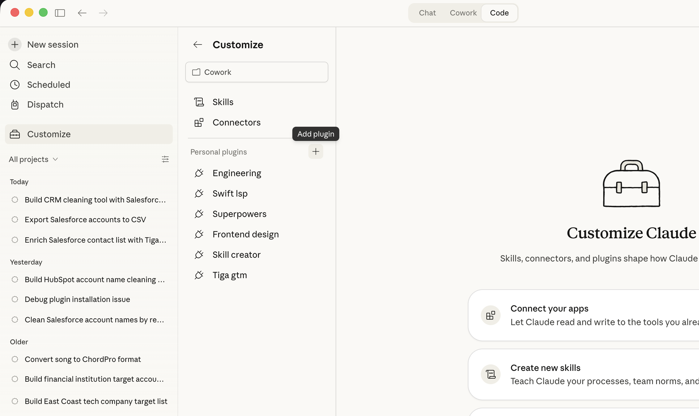
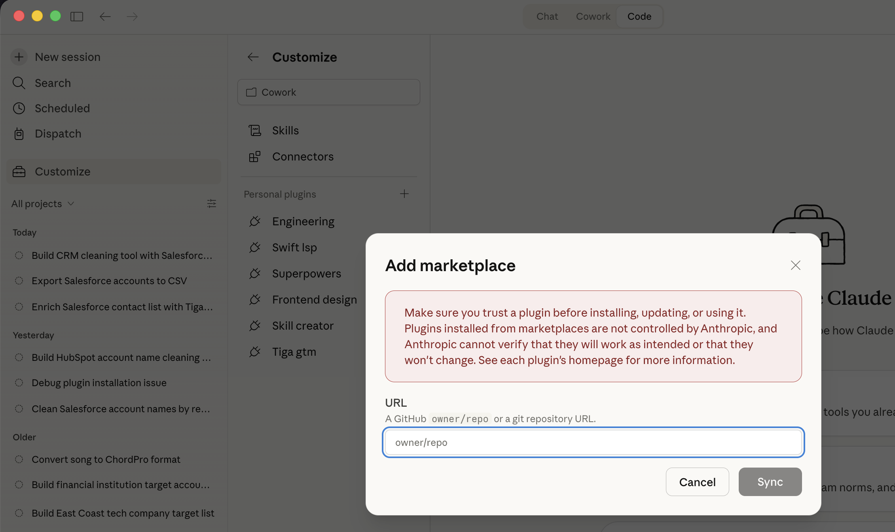
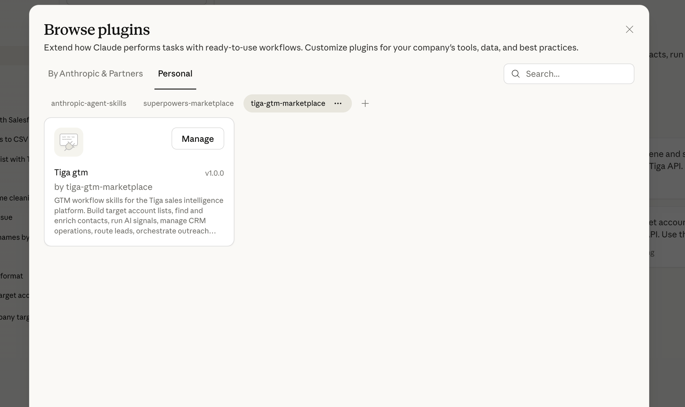

# Tiga GTM

GTM workflow skills for the [Tiga](https://tigalabs.com) sales intelligence platform. Build target account lists, find and enrich contacts, run AI signals, manage CRM operations, route leads, and orchestrate outreach — all from Claude Code.

## Installation

### Step 1: Add the Tiga GTM Marketplace

Open Claude Code and navigate to the **Customize** page from the left sidebar. Click the **Add plugin** button in the top-right area of the plugins section.

### Step 2: Enter the Marketplace URL

In the **Add marketplace** dialog, enter `tiga-labs/tiga-gtm` in the URL field and click **Sync**.

### Step 3: Install the Plugin

After syncing, go to **Browse plugins** and select the **Personal** tab. You'll see the **tiga-gtm-marketplace** listed. Find the **Tiga gtm** plugin and click **Manage** to install it.

Once installed, the Tiga GTM skills will appear in your personal plugins list and are ready to use in any Claude Code conversation.

## Skills Included

- **Prospecting** — Build target account lists matching your ICP
- **Contact Discovery** — Find and enrich contacts with email and phone
- **Signals** — Research accounts with AI-powered buying signals
- **CRM Ops** — Detect job changes, fill gaps, and clean CRM data
- **Lead Routing** — Filter and route inbound leads
- **Outreach** — Manage sequences and personalize messaging
- **Flow Builder** — Construct `play_type: flow` agent flows (HubSpot import, enrich, research, ICP filter, signal gate, sequence hand-off)
- **CRM Bulk Ops** — Build Go web apps for batch CRM operations
